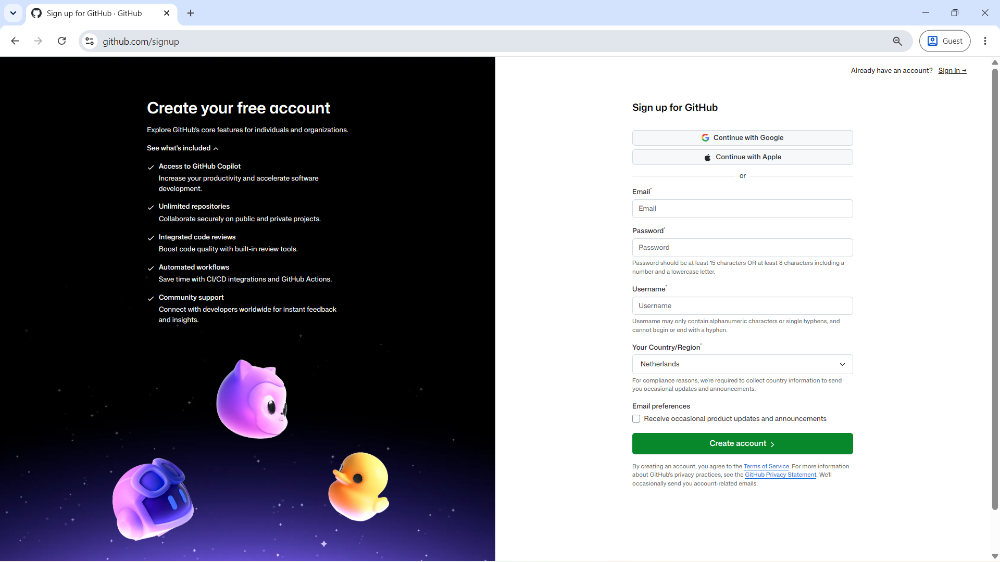
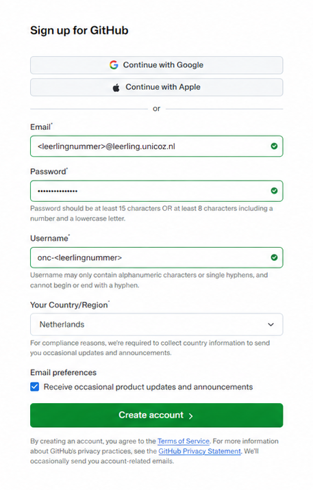
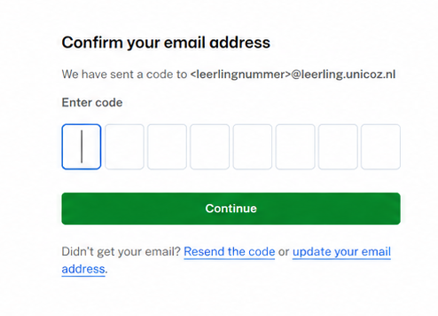
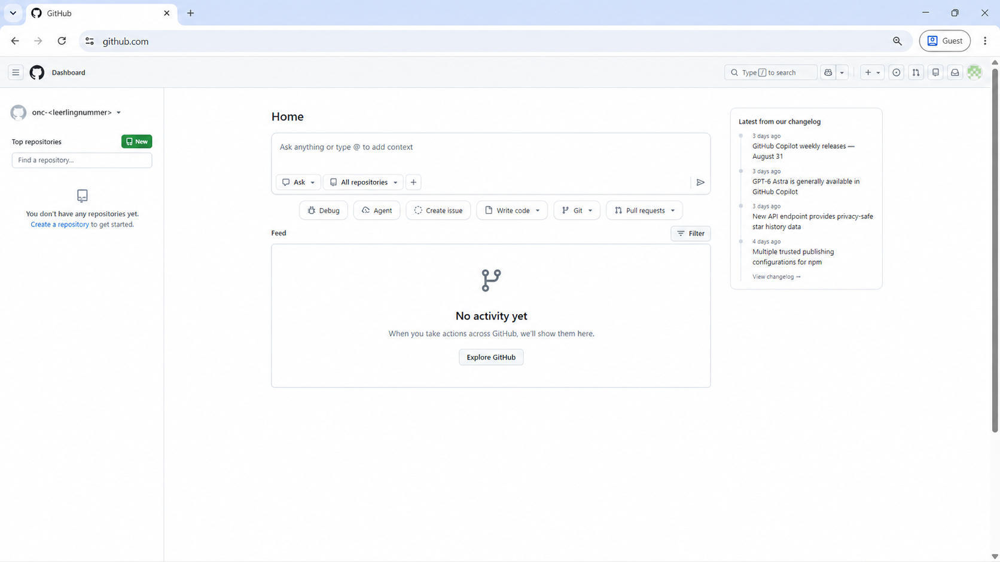

# Git & GitHub

Deze handleiding helpt je bij het opzetten en gebruiken van Git en GitHub tijdens deze module.

## Wat zijn Git en GitHub? {.page-toc}

Tijdens Informatica ga je veel werken met bestanden waarin code staat. Terwijl je programmeert, verander je die bestanden steeds: je voegt code toe, past iets aan, probeert een andere oplossing of herstelt een fout.

### Git

**Git** is een systeem voor versiebeheer.

Met Git kun je tijdens het werken momenten in de ontwikkeling van een project vastleggen. Zo'n opgeslagen moment heet een *commit*. Daardoor ontstaat een geschiedenis van je project waarin je later kunt terugzien:

- wat er is veranderd;
- wanneer iets is veranderd;
- wie een verandering heeft gemaakt;
- en waarom die verandering is gemaakt.

Dat is vooral belangrijk bij software, omdat een programma voortdurend wordt ontwikkeld en onderhouden. Als een verandering later problemen veroorzaakt, kun je in de geschiedenis terugzoeken wat er is gebeurd.

Git werkt op je eigen computer. Je hebt GitHub dus niet nodig om Git te kunnen gebruiken.

### GitHub

**GitHub** is een online platform dat gebouwd is rondom Git.

Een project op GitHub noemen we een *repository*. In zo'n repository staat niet alleen de actuele versie van de bestanden, maar ook de Git-history van het project.

GitHub wordt gebruikt om software samen te **ontwikkelen, beheren en onderhouden**.

Meerdere mensen kunnen aan hetzelfde project werken zonder voortdurend bestanden naar elkaar te hoeven sturen. GitHub helpt daarbij onder andere met:

- samenwerken aan dezelfde code;
- veranderingen van verschillende ontwikkelaars bij elkaar brengen;
- veranderingen bespreken en controleren voordat ze worden toegevoegd;
- problemen, bugs en nieuwe ideeën vastleggen met **Issues**;
- bijhouden wie ergens aan werkt;
- documentatie bij een project bewaren;
- nieuwe versies van software publiceren;
- en websites rechtstreeks vanuit een repository publiceren.

Daardoor is GitHub veel meer dan alleen een plek om een back-up van code te bewaren.

GitHub wordt gebruikt door individuele programmeurs, studenten, docenten en open-sourceprojecten, maar ook door professionele softwareteams en organisaties. Kleine bedrijven kunnen er met een paar ontwikkelaars aan één product werken, terwijl grote organisaties GitHub gebruiken voor projecten waaraan honderden of duizenden mensen bijdragen.

Ook veel software die je dagelijks gebruikt wordt op deze manier ontwikkeld en onderhouden.

Git en GitHub horen dus bij elkaar, maar zijn niet hetzelfde:

- **Git** houdt de versies en veranderingen van een project bij;
- **GitHub** maakt het mogelijk om Git-projecten online te bewaren, te delen, samen te ontwikkelen en te onderhouden.

## GitHub-account aanmaken {.page-toc}

Om GitHub tijdens Informatica te kunnen gebruiken, heb je een eigen GitHub-account nodig.

Het account dat je met deze handleiding aanmaakt, is **geen oefenaccount**. Je gebruikt dit account tijdens deze module en bij volgende modules van het vak Informatica.

!!! info "Dit account is onderdeel van je schoolwerk"

    Volg de stappen in deze handleiding precies.

    - Gebruik je schoolmailadres: `<leerlingnummer>@leerling.unicoz.nl`
    - Gebruik als GitHub-gebruikersnaam: `onc-<leerlingnummer>`
    - Maak maar **één GitHub-account** aan.
    - Verander na het aanmaken geen accountinstellingen, tenzij je daar tijdens de les instructie voor krijgt.
    - Verwijder geen onderdelen waarvan je niet weet waarvoor ze dienen.

    Door zelf instellingen, accountgegevens of later repositories te wijzigen of te verwijderen, kun je koppelingen of opgeslagen schoolwerk beschadigen. **Niet alles kan door de docent worden hersteld.**

    Wil je zelf met GitHub experimenteren? Maak daarvoor een apart persoonlijk GitHub-account.

!!! note "Wat betekent `<leerlingnummer>`?"

    In deze handleiding is `<leerlingnummer>` een **placeholder**.

    Dat betekent dat je het hele stuk `<leerlingnummer>` vervangt door je eigen leerlingnummer.

    De tekens `<` en `>` typ je **niet** mee.

    Dus:

    - `<leerlingnummer>@leerling.unicoz.nl` betekent: je eigen leerlingnummer, direct gevolgd door `@leerling.unicoz.nl`
    - `onc-<leerlingnummer>` betekent: `onc-`, direct gevolgd door je eigen leerlingnummer

### 1. Open GitHub {.section-guide-step}

Ga naar:

**https://github.com/signup**

Je komt op de pagina **Create your free account**.

Gebruik **niet** `Continue with Google` of `Continue with Apple`.

Je maakt het account aan met je **schoolmailadres**.

### 2. Vul je schoolmailadres in {.section-guide-step}

Bij **Email** vul je je schoolmailadres in:

`<leerlingnummer>@leerling.unicoz.nl`

Vervang `<leerlingnummer>` door je eigen leerlingnummer. Typ de tekens `<` en `>` niet mee.

!!! warning "Let op"

    Controleer je leerlingnummer goed voordat je verdergaat.

### 3. Kies een wachtwoord {.section-guide-step}

Maak bij **Password** een sterk wachtwoord aan dat voldoet aan de eisen van GitHub.

Gebruik een wachtwoord dat je kunt onthouden en dat je niet met andere leerlingen deelt.

!!! info "Belangrijk"

    Je wachtwoord is persoonlijk.

    De docent hoeft je wachtwoord niet te kennen en zal er nooit om vragen.

### 4. Kies de voorgeschreven gebruikersnaam {.section-guide-step}

Bij **Username** gebruik je:

`onc-<leerlingnummer>`

Vervang `<leerlingnummer>` door je eigen leerlingnummer. Je gebruikersnaam bestaat dus uit `onc-` direct gevolgd door je leerlingnummer.

Bedenk **geen eigen gebruikersnaam**.

!!! danger "Gebruikersnaam bestaat al?"

    Geeft GitHub aan dat deze gebruikersnaam al bestaat?

    **Stop dan.**

    Kies niet zelf een andere gebruikersnaam en maak geen tweede account aan. Vraag de docent om hulp.

### 5. Controleer de overige gegevens {.section-guide-step}

Controleer of bij **Your Country/Region** staat:

**Netherlands**

De optie bij **Email preferences** is niet nodig voor het vak Informatica. Je hoeft je niet aan te melden voor productupdates en aankondigingen van GitHub.

Controleer daarna nog één keer:

- je schoolmailadres;
- je gebruikersnaam `onc-<leerlingnummer>`;
- het gekozen land.

Als alles klopt, klik je op:

**Create account**

### 6. Bevestig je schoolmailadres {.section-guide-step}

GitHub stuurt een e-mail naar je schoolmailadres.

Open je schoolmail en zoek de e-mail van GitHub. In deze e-mail staat een **code van 8 cijfers**.

Ga terug naar GitHub en vul deze code in.

Klik daarna op **Continue**.

### 7. Je account is aangemaakt {.section-guide-step}

Na het bevestigen van je e-mailadres is je GitHub-account aangemaakt.

GitHub kan je direct aanmelden.

Als je eerst het inlogscherm krijgt, log je in met:

**Username**

`onc-<leerlingnummer>`

en het wachtwoord dat je zojuist hebt aangemaakt.

Wanneer je het GitHub-dashboard ziet, ben je klaar.

!!! success "Klaar"

    **Doe nu niets anders in GitHub.**

    Maak nog geen repositories aan en verander geen instellingen.

    Tijdens de lessen krijg je stap voor stap instructie voor het gebruik van GitHub.