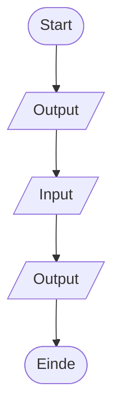

# Thinking Set 1 *Order Here!*

--8<-- "includes/badges.html:ct-algoritmen"
--8<-- "includes/badges.html:process-expressing"

## Waar werk je aan?

In deze Thinking Set werk je aan het volgende leerdoel:

- Ik kan **een geordende reeks instructies formuleren** om een probleem op te lossen.

## De challenge

Een klant probeert een bestelling te plaatsen, maar de communicatie verloopt moeizaam doordat de medewerker vasthoudt aan een vaste manier van communiceren.

Een digitale bestelzuil heeft geen medewerker die kan uitleggen wat er bedoeld wordt. De gebruiker ziet alleen wat het systeem toont en kan alleen reageren op wat gevraagd wordt.

De interactie moet daarom zo worden ontworpen dat iedere stap duidelijk en logisch naar de volgende leidt.

**Hoe ontwerp je een interactie waarbij een gebruiker stap voor stap op een duidelijke en voorspelbare manier met een systeem communiceert?**

## Maak je denken zichtbaar

Werk jullie oplossing uit als een **flowchart**.

Een flowchart maakt zichtbaar in welke volgorde de stappen van een proces worden uitgevoerd.

## Understanding

{{ understanding_reference(understanding) }}

## Test jullie oplossing

Geef jullie **flowchart** aan een andere groep.

Laat hen de ontworpen gebruikersflow stap voor stap volgen zonder dat jullie uitleg geven.

**Kunnen zij jullie gebruikersflow zonder uitleg volgen en leidt iedere stap logisch naar de volgende?**
