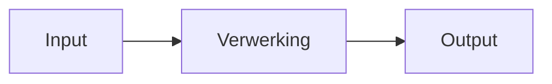

# Thinking Set 2 *Looptest Challenge*

--8<-- "includes/badges.html:ct-abstractie"
--8<-- "includes/badges.html:process-formulating"

## Waar werk je aan?

In deze Thinking Set werk je aan de volgende leerdoelen:

- Ik kan **analyseren** welke informatie relevant is voor het probleem.
- Ik kan een complexe situatie **vereenvoudigen tot de essentiële kenmerken**.
- Ik kan de relevante informatie **representeren in een abstract model**.
- Ik kan het **algemene concept achter de gekozen representatie** verwoorden.

## De challenge

Forrest rent een uitzonderlijke afstand, maar de film laat niet zien hoe deze prestatie objectief kan worden beschreven of vergeleken.

Mensen moeten prestaties uit de werkelijkheid kunnen omzetten naar objectieve informatie, zodat deze gemeten, vergeleken en geïnterpreteerd kunnen worden.

**Hoe ontwerp je een informatiemodel waarmee een loopprestatie kan worden vastgelegd, berekend en overzichtelijk gepresenteerd?**

## Maak je denken zichtbaar

Werk jullie oplossing uit als een **IPO-diagram**.

Een IPO-diagram maakt zichtbaar welke informatie een systeem ontvangt, hoe deze informatie wordt verwerkt en welke informatie het systeem oplevert.

## Understanding

{{ understanding_reference(understanding) }}

## Test jullie oplossing

Geef jullie **IPO-diagram** aan een andere groep.

Laat hen met jullie informatiemodel dezelfde loopprestatie vastleggen en de resultaten bepalen.

**Kunnen zij met jullie informatiemodel dezelfde loopprestatie vastleggen en tot dezelfde resultaten komen?**
