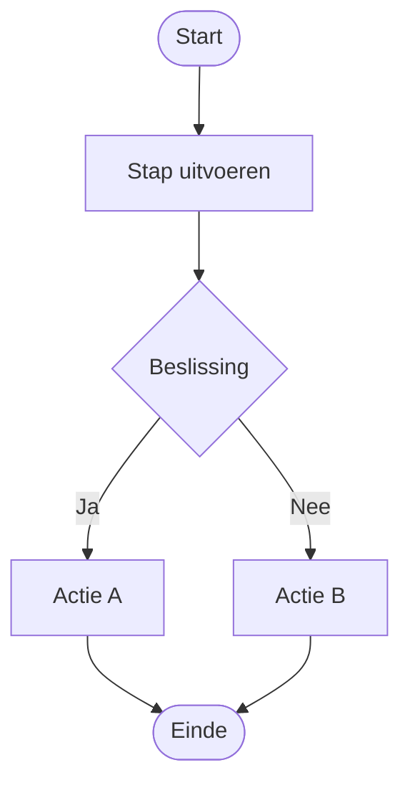

# Thinking Set 3 *Guess the Number*

--8<-- "includes/badges.html:ct-algoritmen"
--8<-- "includes/badges.html:process-expressing"

## Waar werk je aan?

In deze Thinking Set werk je aan de volgende leerdoelen:

- Ik kan **beredeneren** hoe stappen en beslissingen logisch met elkaar samenhangen.
- Ik kan **een algoritmische oplossing ontwerpen** voor een probleem.
- Ik kan **een oplossing formuleren** als een geordende reeks stappen en beslissingen.

## De challenge

In de pot zit een onbekend aantal jellybeans.

Na iedere gok kan het antwoord **te hoog**, **te laag** of **precies goed** zijn.

Bij iedere gok is de situatie anders. Om steeds de juiste reactie te geven, moet duidelijk zijn **welke voorwaarden gelden en welke beslissing daarbij hoort**.

**Ontwerp een beslissysteem dat voor iedere mogelijke gok bepaalt welk antwoord gegeven moet worden.**

## Maak je denken zichtbaar

Werk jullie oplossing uit als een **flowchart**.

Een flowchart laat zien welke stappen worden uitgevoerd en waar beslissingen worden genomen.



Zet daarna **dezelfde oplossing** om in pseudocode.

Pseudocode beschrijft de logica van jullie oplossing als een geordende reeks stappen en beslissingen.

```text
1. Voer een stap uit

2. Controleer de situatie
   2.1 Als de condition waar is, voer actie A uit
   2.2 Anders, voer actie B uit

3. Ga verder met de volgende stap
```

Gebruik gewone taal. Beschrijf **wat er logisch moet gebeuren**, zonder Python-code te schrijven.

## Understanding

{{ understanding_reference(understanding) }}

## Test jullie oplossing

Geef jullie flowchart en pseudocode aan een andere groep.

Laat hen verschillende situaties door jullie beslissysteem doorlopen.

Controleer:

- komen beide uitwerkingen in iedere situatie tot de juiste beslissing?
- beschrijven de flowchart en pseudocode dezelfde oplossing?
