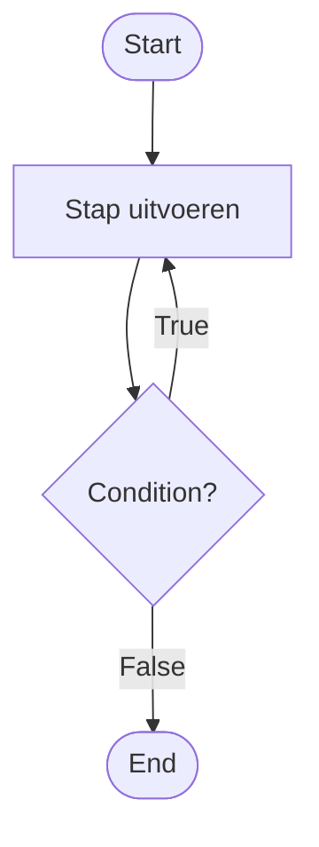

# Thinking Set 4 *Cash Challenge*

--8<-- "includes/badges.html:ct-algoritmen"
--8<-- "includes/badges.html:process-expressing"

## Waar werk je aan?

In deze Thinking Set werk je aan de volgende leerdoelen:

- Ik kan **beredeneren** hoe opeenvolgende stappen logisch samenhangen.
- Ik kan **één of meerdere algoritmische oplossingen genereren**.

## De challenge

Kevin betaalt meer voor zijn pizza dan nodig is. De pizzabezorger accepteert het geld en zegt: "Keep the change."

Mensen moeten een bedrag systematisch kunnen omzetten in een verzameling munten of biljetten, waarbij dezelfde handeling net zo lang wordt herhaald totdat het volledige wisselgeld is teruggegeven.

**Hoe ontwerp je een systeem dat een herhalende handeling blijft uitvoeren totdat een vooraf bepaalde eindtoestand is bereikt?**

## Maak je denken zichtbaar

Werk jullie oplossing uit als een **flowchart**.

Een flowchart maakt zichtbaar welke stappen worden herhaald en onder welke voorwaarde het proces doorgaat of stopt.


Zet daarna **dezelfde oplossing** om in pseudocode.

Een herhalend proces kan er in pseudocode bijvoorbeeld zo uitzien:

```text
1. Bepaal de beginsituatie

2. Zolang het doel nog niet is bereikt
   2.1 Voer de volgende stap uit
   2.2 Werk de toestand bij

3. Toon het resultaat
```

Maak in jullie pseudocode zichtbaar:

- welke stappen worden herhaald;
- wanneer de herhaling doorgaat;
- wat tijdens iedere herhaling verandert;
- en wanneer het proces stopt.

Gebruik gewone taal en beschrijf **wat er logisch moet gebeuren**, zonder Python-code te schrijven.

## Understanding

{{ understanding_reference(understanding) }}

## Test jullie oplossing

Geef jullie **flowchart en pseudocode** aan een andere groep.

Laat hen verschillende bedragen door jullie systeem doorlopen.

**Geeft het systeem voor verschillende bedragen steeds het juiste wisselgeld terug en stopt het precies wanneer er geen wisselgeld meer over is?**

**Beschrijven jullie flowchart en pseudocode daarbij dezelfde oplossing?**

