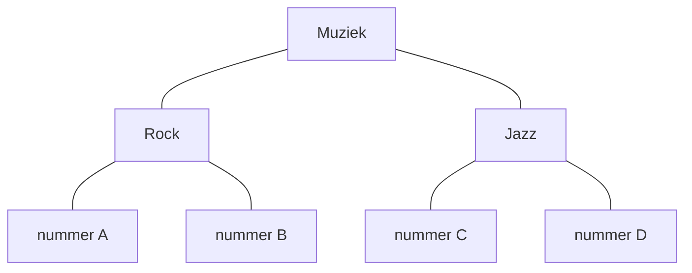

# Thinking Set 5 *Hogwarts Houses*

--8<-- "includes/badges.html:ct-data"
--8<-- "includes/badges.html:process-formulating"

## Waar werk je aan?

In deze Thinking Set werk je aan de volgende leerdoelen:

- Ik kan **analyseren welke gegevens relevant zijn** voor een probleem.
- Ik kan **gegevens ordenen in een bruikbare structuur**.

## De challenge

Op Hogwarts worden nieuwe leerlingen door de Sorting Hat verdeeld over vier huizen.

Iedere leerling moet worden onthouden, zodat later kan worden teruggevonden in welk huis die leerling zit.

Wanneer er steeds meer leerlingen bijkomen, moet de informatie overzichtelijk blijven.

**Hoe ontwerp je een systeem waarmee gegevens overzichtelijk kunnen worden gegroepeerd en later eenvoudig kunnen worden teruggevonden?**

## Maak je denken zichtbaar

Werk jullie oplossing uit als een **datastructuurdiagram**.

Een datastructuurdiagram laat zien hoe gegevens zijn georganiseerd en welke gegevens bij elkaar horen.

## Understanding

{{ understanding_reference(understanding) }}

## Test jullie oplossing

Geef jullie datastructuurdiagram aan een andere groep.

Laat hen nieuwe gegevens toevoegen en bestaande gegevens terugvinden.

**Kunnen zij nieuwe gegevens toevoegen en bestaande gegevens correct terugvinden binnen jullie gekozen structuur?**
